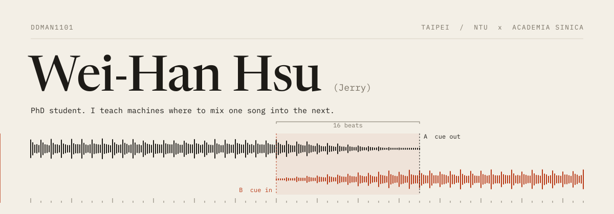
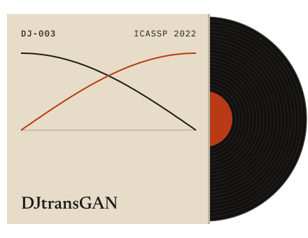

<picture>
  <source media="(prefers-color-scheme: dark)" srcset="assets/header-dark.svg">
  
</picture>

Most of my work is about timing. In a pop song there are only a few bars where another track can come in without two singers colliding, so I build systems that find those bars, plan the mix, and then check the rendered audio to see whether it actually worked.

PhD student at National Taiwan University and Academia Sinica, with Li Su and Yi-Hsuan Yang.

 

<b>DJ-001</b>&nbsp; DJustify: an LLM plans each transition, a checker measures the render and sends back what failed. 
<b>DJ-002</b>&nbsp; Separate-and-Detect: split a drum kit into five stems with latent diffusion, then transcribe each one. 
<b>DJ-003</b>&nbsp; DJtransGAN: fader and EQ curves learned from real DJ mixes (second author).

  

Off the decks: basketball most weekends.
[ddman1101.github.io](https://ddman1101.github.io/) &nbsp;·&nbsp; ddman821101@gmail.com
