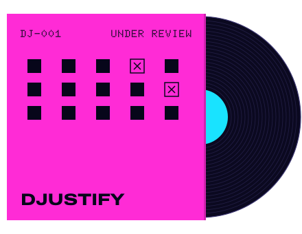
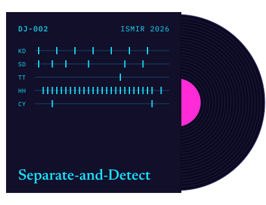
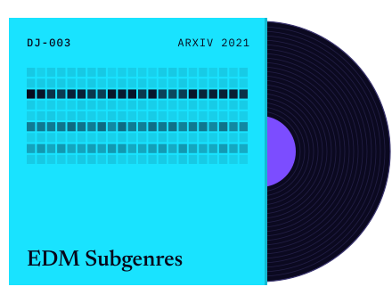

Machine learning for music, on both the listening side and the making side. PhD student at National Taiwan University and Academia Sinica, with Li Su and Yi-Hsuan Yang.

 

<b>DJ-001</b>&nbsp; DJustify: an LLM plans each mix, a checker measures the render and sends back what failed. 
<b>DJ-002</b>&nbsp; Separate-and-Detect: split a drum kit into five stems with latent diffusion, then transcribe each one. 
<b>DJ-003</b>&nbsp; EDM Subgenres: tempogram features added to a music auto-tagging CNN to tell EDM subgenres apart. 
Also: <a href="https://arxiv.org/abs/2110.06525">DJtransGAN</a> (ICASSP 2022, second author).

  

After hours: DJing, basketball most weekends.
[ddman1101.github.io](https://ddman1101.github.io/) &nbsp;·&nbsp; ddman821101@gmail.com
